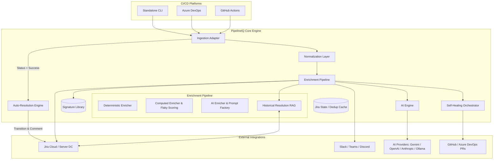
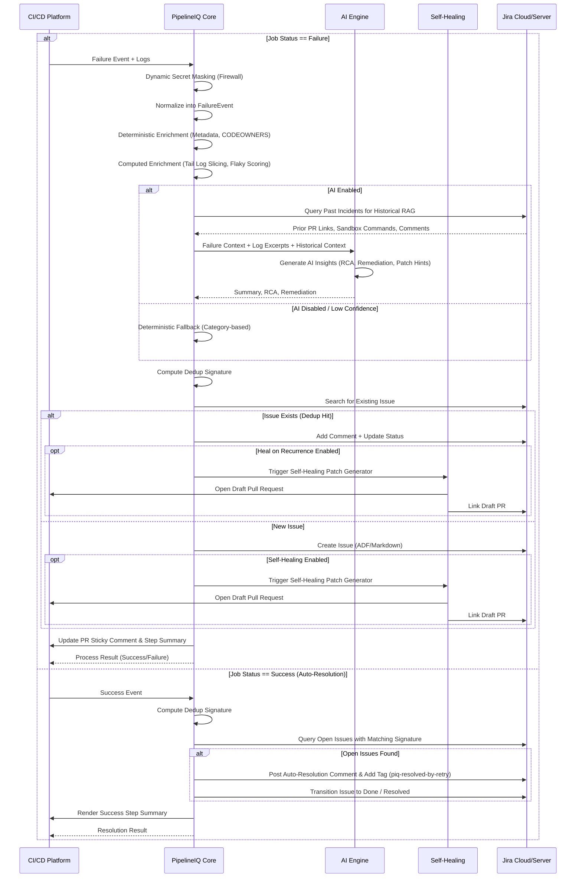

# PipelineIQ Architecture & Technical Specification

PipelineIQ is an AI-powered failure intelligence platform designed to transform noisy CI/CD pipeline failures into structured, actionable operational intelligence. This document provides a comprehensive technical and business overview of the system architecture.

---

## 1. Overview

### Purpose
PipelineIQ bridges the "Intelligence Gap" between automated CI/CD pipelines (GitHub Actions, Azure DevOps) and incident management (Jira). It automates the extraction, analysis, and reporting of failures to minimize developer toil and downtime.

### Business Problem
- **MTTR (Mean Time To Resolution)**: High due to manual log analysis and context switching.
- **Noise & Toil**: Duplicate incidents and low-quality Jira tickets flood engineering teams.
- **Lack of Standard**: Inconsistent reporting across different CI/CD platforms and teams.

### Core Objectives
1. **Reduce MTTR**: Provide instant root-cause analysis (RCA) and remediation steps.
2. **Operational Standards**: Enforce high-fidelity reporting with 80-120 data points per incident.
3. **Automated Deduplication**: Group similar failures to prevent ticket floods.
4. **AI-Assisted Efficiency**: Use LLMs to summarize complex logs into human-readable insights.

### Current Scope
- Integration with GitHub Actions and Azure DevOps.
- Support for Jira Cloud and Jira Server/Data Center.
- Deterministic and AI-driven enrichment.
- Two-way Jira lifecycle synchronization (auto-resolution on pipeline retry / success).
- Flaky test intelligence & scoring across pipeline executions.
- Autonomous remediation (Self-healing pipelines with Historical Resolution RAG).
- Dynamic secret masking firewall with runtime environment discovery.
- Rich CI/CD reporting: PR sticky commenting and job step summaries.
- SRE intelligence and deployment risk scoring.

---

## 2. Architecture Goals

- **Scalability**: Stateless core engine capable of processing thousands of pipeline failures in parallel.
- **Reliability**: Deterministic-first design ensuring reports are generated even if AI services fail.
- **Extensibility**: Plugin-based architecture for CI/CD adapters, AI providers, and ticketing systems.
- **Security**: Robust secret masking and log sanitization to protect sensitive operational data.
- **Low Overhead**: Zero-configuration defaults with high-fidelity "auto-discovery" of metadata.

---

## 3. High-Level Architecture

PipelineIQ follows a modular, adapter-based architecture. The core processing engine is decoupled from the specific CI/CD platform and the ticketing destination.

### System Diagram



---

### 3.1 Visual Architecture Diagrams

For a more granular view of the system's structural design and operational logic, refer to the following high-fidelity diagrams:

| Diagram | File | Purpose |
|---|---|---|
| 🏗️ Structural Architecture | **[pipelineiq-arch-structural.drawio](./pipelineiq-arch-structural.drawio)** | Adapter ingestion layer, ESM core pipeline, and AI abstraction hub |
| ⚙️ Operational Process Flow | **[pipelineiq-arch-operational-flow.drawio](./pipelineiq-arch-operational-flow.drawio)** | End-to-end flow: log sanitization → enrichment → confidence gating → Jira dispatch |
| 🔐 Deployment & Security Topology | **[pipelineiq-arch-deployment-topology.drawio](./pipelineiq-arch-deployment-topology.drawio)** | Execution contexts, network egress boundaries, secret masking firewall, and deployment modes |

> [!TIP]
> All three diagrams are kept in sync with the current implementation. They include "Deep Dive" logic for the **AI Prompt Factory** (`ai-engine.ts`), **Fingerprint Stabilizer** (`dedup.ts`), and **Multi-Platform Renderer** (`enhanced-client.ts`).

> [!IMPORTANT]
> The Deployment & Security Topology diagram explicitly shows that **raw secrets never leave the runner environment**. The `secret-mask.ts` dynamic firewall runs before any data is dispatched to Jira or AI providers.

---

## 4. End-to-End Workflow

### Pipeline Failure Lifecycle
1. **Trigger**: A CI/CD pipeline step fails.
2. **Collection**: The PipelineIQ Adapter (Action/Task) is triggered on `failure()`.
3. **Normalization**: Raw logs and environment variables are mapped to the `FailureEvent` schema.
4. **Enrichment**:
    - **Deterministic**: Context discovery (Repo, Branch, Commit, CODEOWNERS mapped via `userMapping`).
    - **Computed**: Signature matching (Regex), Flaky score computation, and Dedup Signature calculation using tail log slicing.
    - **AI**: (Optional) LLM-driven RCA, Remediation, and Historical Resolution RAG.
5. **Deduplication**: Search Jira for existing issues with the same signature.
6. **Reporting**: Create or update a Jira issue with rich Markdown/ADF content.
7. **Self-Healing**: Triggered on new tickets or on recurrent deduplication hits if `healOnRecurrence: true`. Generates and verifies code patches, then creates Draft PRs.
8. **CI/CD Feedback**: Updates PR sticky comments and generates rich GitHub Actions Step Summaries.

### Pipeline Success & Auto-Resolution Lifecycle
When a pipeline job succeeds (e.g. following a retry, fix commit, or subsequent run) and `dedup.autoResolveOnSuccess` is enabled:
1. **Trigger**: PipelineIQ runs with `status: success` (e.g., via GitHub Action `if: always()`, Azure DevOps `condition: always()`, or `pipelineiq resolve`).
2. **Signature Computation**: Reconstructs the deterministic pipeline signature (`repo + workflow + step + category`).
3. **Issue Discovery**: Queries Jira for open issues matching `labels = "piq-sig:<sig>"`.
4. **Lifecycle Transition**: Adds an informative resolution comment with commit/run details, tags the issue with `piq-resolved-by-retry`, and executes the Jira workflow transition to `Done` or `Resolved`.
5. **Flaky Intelligence**: Tracks the retry-resolution event, updating historical flakiness analytics for subsequent runs.

### Sequence Diagram


---

## 5. Core Components

### CLI Engine (`src/cli/`)
The primary interface for local analysis and the entry point for platform adapters. It features:
- `pipelineiq init`: Interactive setup wizard for Jira Cloud/Server, AI providers, and automation policies.
- `pipelineiq analyze`: Failure analysis, Jira dispatch, and self-healing orchestration.
- `pipelineiq resolve`: Standalone resolution command to transition open Jira issues on pipeline success.
- `pipelineiq test`: Proactive connectivity diagnostic for Jira and AI providers.

### CI/CD Adapters (`src/github-action/`, `src/azure-devops/`)
Platform-specific layers that translate execution contexts into unified `FailureEvent` models.
- **GitHub Action (`src/github-action/index.ts`)**: Supports PR sticky comment updates with collapsible diagnostics, rich run execution step summaries, and automatic resolution when `jobStatus === "success"`.
- **Azure DevOps Task (`src/azure-devops/index.ts`)**: Full feature parity with inputs for auto-resolution (`autoResolveOnSuccess`, `resolveTransition`) and self-healing configuration in `task.json`.

### Auto-Resolution Engine (`src/core/resolve.ts`)
Orchestrates two-way lifecycle synchronization between CI/CD runs and Jira. It matches open tickets by signature label (`piq-sig:<sig>`), posts context-rich resolution comments, executes transition steps (defaulting to "Done" or "Resolved"), and marks tickets with `piq-resolved-by-retry`.

### Deduplication & Fingerprint Stabilizer (`src/core/dedup.ts`)
Calculates deterministic MD5 hashes across repository, workflow, step, and failure signature.
- **Tail-Log Slicing**: Normalizes CRLF and ANSI escape codes and slices the trailing 3,000 characters of execution logs (extracting a 500-char excerpt) when error messages are empty, eliminating false-positive runner initialization collisions.

### Secret Masking Firewall (`src/core/secret-mask.ts`)
A multi-layered redaction engine that executes before any log data leaves the runner:
- **Dynamic Runtime Secret Discovery (`getRuntimeEnvironmentSecrets()`)**: Inspects `process.env` dynamically for sensitive values, tokens, and keys matching known patterns (`TOKEN`, `KEY`, `SECRET`, `PASSWORD`, `CREDENTIAL`).
- **Static Pattern Matching**: Redacts AWS/GCP/Azure credentials, JWTs, Bearer tokens, private keys, and connection strings.

### Flaky Test Intelligence (`src/core/jira/history.ts`, `src/core/enrichers/history.ts`)
Analyzes historical incident patterns across runs:
- Tracks total occurrences, previous resolution status, and retry-resolved counts.
- Computes dynamic flakiness percentage scores (`flakinessScore = (retryResolvedCount / occurrences) * 100`).
- Renders flaky indicators and metrics in Jira descriptions and CI/CD step summaries.

### Local & Historical Context Engine (`src/core/enrichers/codeowners.ts`, `src/core/self-healing/engine.ts`)
- **CODEOWNERS Identity Mapping (`userMapping`)**: Maps GitHub/GitLab usernames directly to Jira account IDs or user names.
- **Historical Resolution RAG (`buildHistoricalRAGContext`)**: Queries Jira for previously resolved tickets with the same signature, extracting past fix PR links, sandbox verification commands, and resolution comments to prime the AI Fix Generator.

---

## 6. Repository Structure

```txt
pipelineiq/
├── bin/                  # CLI executable
├── dist/                 # Compiled ESM/CJS artifacts
├── scripts/              # Build and versioning scripts
├── src/
│   ├── azure-devops/     # Azure DevOps Task adapter
│   ├── cli/              # Commander-based CLI
│   ├── core/             # Central Processing Engine
│   │   ├── ai/           # LLM Providers and Engine
│   │   ├── enrichers/    # Pipeline Stages (Det/Comp/AI/CODEOWNERS/Flaky)
│   │   ├── jira/         # Jira Client Abstractions & History
│   │   ├── log-parser/   # Diagnostic extractors
│   │   ├── self-healing/ # Autonomous patch generation & RAG
│   │   ├── types/        # Zod Schemas and Domain Types
│   │   ├── dedup.ts      # Fingerprint Stabilizer & Tail Slicing
│   │   ├── resolve.ts    # Two-Way Jira Lifecycle Sync
│   │   ├── secret-mask.ts# Dynamic Secret Masking Firewall
│   │   └── index.ts      # Core Engine Exports
│   ├── github-action/    # GitHub Actions adapter (Sticky Comments & Summaries)
│   └── index.ts          # Main Package Entry
├── action.yml            # GitHub Action Metadata
├── task.json             # Azure DevOps Extension Metadata
└── package.json          # Project manifest and dependencies
```

---

## 7. Integration Architecture

### AI Providers
PipelineIQ uses a provider-interface pattern to support multiple LLMs:
- **Google Gemini**: Default provider for high-speed, cost-effective analysis (v1.5, v2.0, v2.5 Flash).
- **OpenAI / Anthropic**: Supported for high-reasoning tasks (GPT-4o, Claude 3.5/3.7).
- **LocalAI / Ollama**: Supported for air-gapped or sensitive enterprise environments.

---

## 8. AI Architecture

### AI Workflow
1. **Context Clipping**: Logs are truncated to fit token limits (default 4k-8k).
2. **Historical RAG Retrieval**: Past Jira resolution context is retrieved and formatted as few-shot guidance.
3. **Prompt Construction**: Injecting deterministic analysis, source code context, and historical RAG hints.
4. **Generation**: LLM generates JSON-structured insights and surgical code patches.
5. **Validation**: Zod schema validation of AI response.
6. **Confidence Gating**: If confidence < 0.6 (or configurable threshold), discard and use deterministic fallback.

### Fallback Mechanisms
Every AI field has a deterministic producer:
- `summary` → Template-based: "{pipeline} failed at {step} on {branch}"
- `rca` → Signature library lookup.
- `remediation` → Static category-based playbook.

---

## 9. Failure Analysis Architecture

### Pattern Library (`signatures.ts`)
First-match regex library for common DevOps failures:
- **Infrastructure**: Terraform state locks, K8s ImagePullBackOff.
- **Deployment**: Helm upgrade failures, health check timeouts.
- **Build**: Compilation errors, missing dependencies.
- **Security**: Expired tokens, policy violations.

---

## 10. Jira Ticket Architecture

### Enrichment Model
PipelineIQ provides **80-120 operational fields**:
- **System**: Agent OS, Runner Version, Node Version.
- **Context**: Branch, Commit, PR ID, Workflow URL, CODEOWNERS mapping.
- **Intelligence**: Root Cause, Remediation Steps, Dedup Signature, Flakiness Score.
- **Provenance**: AI Provider, Confidence, Ingestion Source.

---

## 11. Autonomous Self-Healing Architecture

### The Self-Healing Engine (`src/core/self-healing/`)
PipelineIQ features a fully autonomous self-healing orchestrator that transforms diagnostic metadata and source code into surgical pull requests.

1. **Local Workspace Context**: Reads failing source files directly from the runner's workspace.
2. **Historical Resolution RAG**: Queries Jira for previous similar incidents, extracting past auto-fix PR links, sandbox verification commands, and remediation notes to guide the LLM.
3. **AI Fix Generator**: Generates concise, snippet-level JSON patches instead of sweeping refactors.
4. **Heal on Recurrence**: Automatically triggers self-healing on recurrent deduplication hits when enabled (`healOnRecurrence: true`).
5. **Local Sandbox Verification**: Executes syntax checks and automated test runs with an agentic feedback loop to verify fixes before pushing.
6. **Resilient Snippet Patching Engine**: Employs whitespace-normalized and trimmed matching heuristics to locate failure target code snippets inside source files.
7. **Git Provider Abstraction**: Commits and creates Draft PRs in GitHub or Azure DevOps with comprehensive audit summaries and cross-links to Jira.

---

## 12. Security Architecture

### Secret Masking Firewall (`secret-mask.ts`)
A defense-in-depth security layer that redacts secrets before data leaves the runner:
- **Dynamic Runtime Environment Secret Discovery**: Automatically iterates over all environment variables at runtime, identifying and redacting credentials, tokens, and keys.
- **Heuristic Pattern Redaction**: Strips AWS/GCP/Azure keys, GitHub/ADO tokens, Bearer tokens, private keys, passwords, and connection strings.

---

## 13. Two-Way Lifecycle Synchronization & Flaky Intelligence

- **Automatic Ticket Closure**: Automatically transitions open Jira incidents to `Done` or `Resolved` when subsequent retries or commits succeed.
- **Flakiness Tracking**: Analyzes resolution patterns to identify intermittent, flaky tests versus persistent bugs, computing a 0–100% flakiness score.
- **Audit Logging**: Resolution comments reference the succeeding run ID, commit SHA, and triggering actor, and apply the `piq-resolved-by-retry` label.

---

## 14. Scalability Considerations

- **Stateless Execution**: The engine does not require a persistent database for core analysis, enabling easy scaling in serverless environments.
- **Memory Efficient**: Log streaming and line-by-line parsing prevent memory exhaustion for multi-GB log files.

---

## 15. Deployment Models

- **Current**: 
  - `npm` package for standard Node environments.
  - Pre-built GitHub Action and Azure DevOps Task.
- **Future**:
  - Containerized SaaS for centralized analytics.
  - Managed self-hosted instance (Helm Chart).

---

## 16. Engineering Decisions & Tradeoffs

- **Why TypeScript?**: Native support in GitHub Actions and the vast Node.js ecosystem for Azure DevOps.
- **Why ESM-First?**: Alignment with modern Node.js standards and future-proofing.
- **Why Deterministic-First?**: AI is non-deterministic; operational intelligence requires a predictable baseline for reliability.

---

## 17. Future Roadmap Architecture

### Phase 1: Foundation (Complete)
- Robust multi-platform ingestion.
- High-fidelity Jira reporting.

### Phase 2: Autonomy & Lifecycle Sync (Current)
- Automated PR creation for known dependency/config fixes via the Self-Healing Engine.
- Historical Resolution RAG for self-healing.
- Two-way Jira lifecycle synchronization.
- Flaky test scoring.

### Phase 3: Intelligence (Future)
- Team-level reliability scoring dashboard.
- Slack-based interactive incident management.

---

## 18. Appendix

### Data Payloads
PipelineIQ uses the **FailureEvent** schema as the source of truth for all internal communications.

```json
{
  "source": "github",
  "pipeline": { "name": "deploy", "runId": "123" },
  "failure": { "errorMessage": "Connection Timeout", "logs": "..." },
  "repository": { "name": "app-api", "owner": "acme-corp" }
}
```

