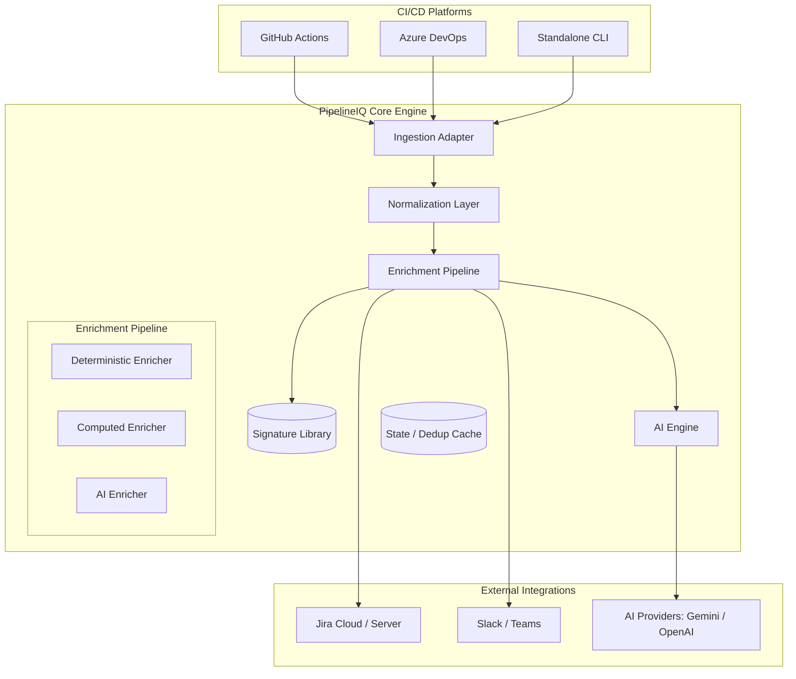
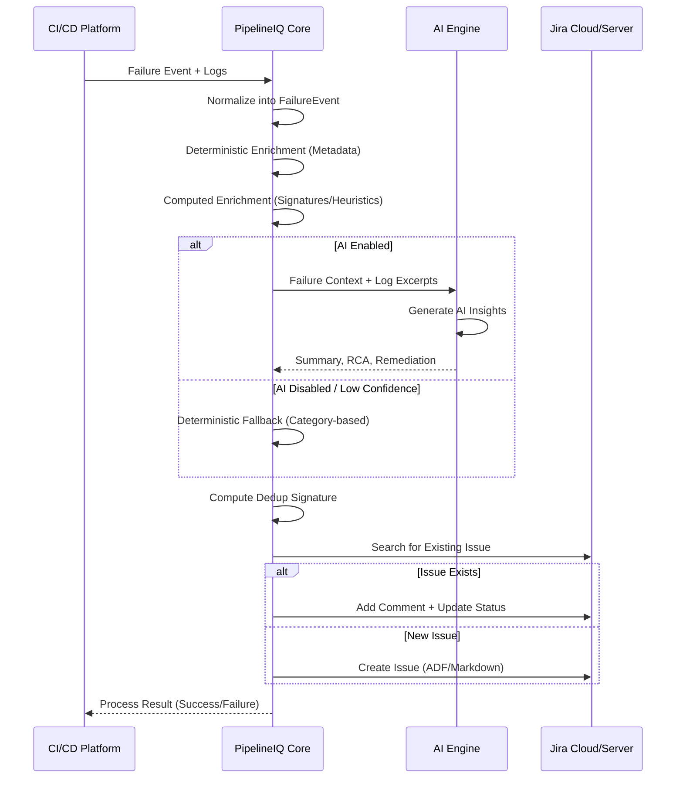

# PipelineIQ Architecture & Technical Specification

PipelineIQ is an AI-powered failure intelligence platform designed to transform noisy CI/CD pipeline failures into structured, actionable operational intelligence. This document provides a comprehensive technical and business overview of the system architecture.

---

## 1. Overview

### Purpose
PipelineIQ bridges the "Intelligence Gap" between automated CI/CD pipelines (GitHub Actions, Azure DevOps) and incident management (Jira). It automates the extraction, analysis, and reporting of failures to minimize developer toil and downtime.

### Business Problem
- **MTTR (Mean Time To Resolution)**: High due to manual log analysis and context switching.
- **Noise & Toil**: Duplicate incidents and low-quality Jira tickets flood engineering teams.
- **Lack of Standard**: Inconsistent reporting across different CI/CD platforms and teams.

### Core Objectives
1. **Reduce MTTR**: Provide instant root-cause analysis (RCA) and remediation steps.
2. **Operational Standards**: Enforce high-fidelity reporting with 80-120 data points per incident.
3. **Automated Deduplication**: Group similar failures to prevent ticket floods.
4. **AI-Assisted Efficiency**: Use LLMs to summarize complex logs into human-readable insights.

### Current Scope
- Integration with GitHub Actions and Azure DevOps.
- Support for Jira Cloud and Jira Server/Data Center.
- Deterministic and AI-driven enrichment.

- Autonomous remediation (Self-healing pipelines).
- Reliability analytics dashboard.
- Deployment risk scoring and SRE intelligence.

---

## 2. Architecture Goals

- **Scalability**: Stateless core engine capable of processing thousands of pipeline failures in parallel.
- **Reliability**: Deterministic-first design ensuring reports are generated even if AI services fail.
- **Extensibility**: Plugin-based architecture for CI/CD adapters, AI providers, and ticketing systems.
- **Security**: Robust secret masking and log sanitization to protect sensitive operational data.
- **Low Overhead**: Zero-configuration defaults with high-fidelity "auto-discovery" of metadata.

---

## 3. High-Level Architecture

PipelineIQ follows a modular, adapter-based architecture. The core processing engine is decoupled from the specific CI/CD platform and the ticketing destination.

### System Diagram



---

### 3.1 Visual Architecture Diagrams

For a more granular view of the system's structural design and operational logic, refer to the following high-fidelity diagrams:

| Diagram | File | Purpose |
|---|---|---|
| 🏗️ Structural Architecture | **[pipelineiq-arch-structural.drawio](./pipelineiq-arch-structural.drawio)** | Adapter ingestion layer, ESM core pipeline, and AI abstraction hub |
| ⚙️ Operational Process Flow | **[pipelineiq-arch-operational-flow.drawio](./pipelineiq-arch-operational-flow.drawio)** | End-to-end flow: log sanitization → enrichment → confidence gating → Jira dispatch |
| 🔐 Deployment & Security Topology | **[pipelineiq-arch-deployment-topology.drawio](./pipelineiq-arch-deployment-topology.drawio)** | Execution contexts, network egress boundaries, secret masking firewall, and deployment modes |

> [!TIP]
> All three diagrams are kept in sync with the current implementation. They include "Deep Dive" logic for the **AI Prompt Factory** (`ai-engine.ts`), **Fingerprint Stabilizer** (`dedup.ts`), and **Multi-Platform Renderer** (`enhanced-client.ts`).

> [!IMPORTANT]
> The Deployment & Security Topology diagram explicitly shows that **raw secrets never leave the runner environment**. The `secret-mask.ts` firewall runs before any data is dispatched to Jira or AI providers.

---

---

## 4. End-to-End Workflow

### Pipeline Failure Lifecycle
1. **Trigger**: A CI/CD pipeline step fails.
2. **Collection**: The PipelineIQ Adapter (Action/Task) is triggered on `failure()`.
3. **Normalization**: Raw logs and environment variables are mapped to the `FailureEvent` schema.
4. **Enrichment**:
    - **Deterministic**: Context discovery (Repo, Branch, Commit).
    - **Computed**: Signature matching (Regex) and Dedup Signature calculation.
    - **AI**: (Optional) LLM-driven RCA and Remediation generation.
5. **Deduplication**: Search Jira for existing issues with the same signature.
6. **Reporting**: Create or update a Jira issue with rich Markdown/ADF content.

### Sequence Diagram


---

## 5. Core Components

### CLI Engine (`src/cli/`)
The primary interface for local analysis and the entry point for platform adapters. It handles configuration merging, interactive setup, and orchestration of the core pipeline.

### CI/CD Adapters (`src/github-action/`, `src/azure-devops/`)
Platform-specific layers that interact with the CI/CD environment. They translate platform-specific contexts (e.g., `GhContext`, `Agent.JobName`) into the unified `FailureEvent` model.

### Log Processing Engine (`src/core/log-parser/`)
Parses raw log streams to extract relevant excerpts, strip ANSI color codes, and identify error boundaries. It supports multi-format parsing (JUnit, Terraform, Docker, etc.).

### Metadata Engine (`src/core/enrichers/deterministic.ts`)
Derives 50+ data points from the environment, including repository ownership, branch protections, commit ancestry, and environment tiers (Dev/Prod).

### Failure Analysis Engine (`src/core/signatures.ts`)
A heuristic engine that matches log patterns against a library of known failure signatures. It provides the initial classification (e.g., "Dependency Conflict", "Infrastructure Timeout") and deterministic remediation steps.

### AI Analysis Engine (`src/core/ai/`)
An LLM-agnostic layer that constructs high-fidelity prompts from the normalized failure context. It utilizes "Confidence Scoring" to ensure AI-generated data is only used when it meets quality thresholds.

### Jira Integration Layer (`src/core/jira/`)
Abstracts the complexities of Jira Cloud and Server. It handles:
- **ADF Rendering**: Converting Markdown to Atlassian Document Format.
- **Field Mapping**: Synchronizing 80+ fields to Jira custom fields.
- **Attachment Management**: Uploading logs and diagnostic artifacts.

---

## 6. Repository Structure

```txt
pipelineiq/
├── bin/                  # CLI executable
├── dist/                 # Compiled ESM/CJS artifacts
├── scripts/              # Build and versioning scripts
├── src/
│   ├── azure-devops/     # Azure DevOps Task adapter
│   ├── cli/              # Commander-based CLI
│   ├── core/             # Central Processing Engine
│   │   ├── ai/           # LLM Providers and Engine
│   │   ├── enrichers/    # Pipeline Stages (Det/Comp/AI)
│   │   ├── jira/         # Jira Client Abstractions
│   │   ├── log-parser/   # Diagnostic extractors
│   │   ├── types/        # Zod Schemas and Domain Types
│   │   └── index.ts      # Core Engine Exports
│   ├── github-action/    # GitHub Actions adapter
│   └── index.ts          # Main Package Entry
├── action.yml            # GitHub Action Metadata
├── task.json             # Azure DevOps Extension Metadata
└── package.json          # Project manifest and dependencies
```

---

## 7. Integration Architecture

### AI Providers
PipelineIQ uses a provider-interface pattern to support multiple LLMs:
- **Google Gemini**: Default provider for high-speed, cost-effective analysis.
- **OpenAI / Anthropic**: Supported for high-reasoning tasks.
- **LocalAI**: Supported for air-gapped or sensitive enterprise environments.

---

## 8. AI Architecture

### AI Workflow
1. **Context Clipping**: Logs are truncated to fit token limits (default 4k-8k).
2. **Prompt Construction**: Injecting deterministic analysis as "Chain of Thought" hints.
3. **Generation**: LLM generates JSON-structured insights.
4. **Validation**: Zod validation of AI response.
5. **Confidence Scoring**: If confidence < 0.6, discard and use deterministic fallback.

### Fallback Mechanisms
Every AI field has a deterministic producer:
- `summary` → Template-based: "{pipeline} failed at {step} on {branch}"
- `rca` → Signature library lookup.
- `remediation` → Static category-based playbook.

---

## 9. Failure Analysis Architecture

### Pattern Library (`signatures.ts`)
First-match regex library for common DevOps failures:
- **Infrastructure**: Terraform state locks, K8s ImagePullBackOff.
- **Deployment**: Helm upgrade failures, health check timeouts.
- **Build**: Compilation errors, missing dependencies.
- **Security**: Expired tokens, policy violations.

---

## 10. Jira Ticket Architecture

### Enrichment Model
Most integrations provide ~10 fields. PipelineIQ provides **80-120 operational fields**:
- **System**: Agent OS, Runner Version, Node Version.
- **Context**: Branch, Commit, PR ID, Workflow URL.
- **Intelligence**: Root Cause, Remediation Steps, Dedup Signature.
- **Provenance**: AI Provider, Confidence, Ingestion Source.

---

## 11. Autonomous Self-Healing Architecture

### The Self-Healing Engine (`src/core/self-healing/`)
PipelineIQ features a fully autonomous self-healing orchestrator that transforms diagnostic metadata and source code into surgical pull requests.

1. **Local Workspace Context**: Instead of guessing based on logs, the engine extracts file paths from the stack trace and uses Node's `fs` to read the exact source code of the failing files directly from the runner's checked-out workspace.
2. **AI Fix Generator**: A specialized prompt constrains the AI to output precise, snippet-level JSON patches instead of sweeping refactors.
3. **Guardrails**:
   - **Confidence Gating**: Requires a minimum AI confidence (default: 0.8).
   - **Scope Limits**: Restricts fixes to a maximum of 3 files and 50 lines.
   - **Path Blocking**: Hardcodes blocked paths (`.env`, `Dockerfile`, `*.key`) to prevent security risks.
4. **Git Provider Abstraction**: Supports both GitHub (Octokit + Git Trees API) and Azure DevOps (REST API). It fetches the original file content, applies the AI's snippet patch locally, and pushes the fully mutated file in an atomic commit.
5. **Draft Pull Requests**: Fixes are always isolated on a new branch (`pipelineiq/fix/*`) and submitted as Draft PRs for human-in-the-loop review.

---

## 12. Security Architecture

### Secret Masking (`secret-mask.ts`)
A heuristic-based defense-in-depth layer that redacts:
- AWS/GCP/Azure Keys
- GitHub/ADO Tokens
- JWTs and Bearer tokens
- Passwords and Connection Strings

---

## 12. Scalability Considerations

- **Stateless Execution**: The engine does not require a persistent database for core analysis, enabling easy scaling in serverless environments.
- **Memory Efficient**: Log streaming and line-by-line parsing prevent memory exhaustion for multi-GB log files.

---

## 13. Deployment Models

- **Current**: 
  - `npm` package for standard Node environments.
  - Pre-built GitHub Action and Azure DevOps Task.
- **Future**:
  - Containerized SaaS for centralized analytics.
  - Managed self-hosted instance (Helm Chart).

---

## 14. Engineering Decisions & Tradeoffs

- **Why TypeScript?**: Native support in GitHub Actions and the vast Node.js ecosystem for Azure DevOps.
- **Why ESM-First?**: Alignment with modern Node.js standards and future-proofing.
- **Why Deterministic-First?**: AI is non-deterministic; operational intelligence requires a predictable baseline for reliability.

---

## 15. Future Roadmap Architecture

### Phase 1: Foundation (Complete)
- Robust multi-platform ingestion.
- High-fidelity Jira reporting.

### Phase 2: Autonomy (Current)
- Automated PR creation for known dependency/config fixes via the Self-Healing Engine.
- Local Workspace Context reading for complex logic bugs.

### Phase 3: Intelligence (Future)
- Historical failure correlation.
- Team-level reliability scoring.
- Slack-based interactive incident management.

---

## 16. Appendix

### Data Payloads
PipelineIQ uses the **FailureEvent** schema as the source of truth for all internal communications.

```json
{
  "source": "github",
  "pipeline": { "name": "deploy", "runId": "123" },
  "failure": { "errorMessage": "Connection Timeout", "logs": "..." },
  "repository": { "name": "app-api", "owner": "acme-corp" }
}
```
