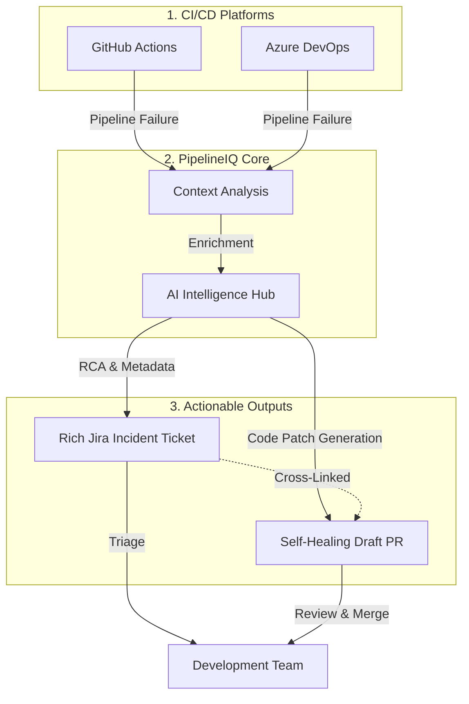

# PipelineIQ

[](https://www.npmjs.com/package/pipelineiq) [](https://www.npmjs.com/package/pipelineiq) [](https://www.npmjs.com/package/pipelineiq)
    
    

PipelineIQ is the **Universal Intelligence Layer** that connects any CI/CD pipeline (**GitHub Actions**, **Azure DevOps**, **GitLab CI**, **Bitbucket Pipelines**, **CircleCI**, **Jenkins**, or **Local CLI**) directly to **Jira**. It automatically transforms raw pipeline failures into high-fidelity, intelligent incident tickets with AI-powered Root Cause Analysis (RCA), Failure Summaries, Suggested Remediation, Releases / FixVersion tracking, deduplication, and deep operational context.

## 🛑 The Problem

Engineering organizations lose thousands of hours every year because:
* **CI/CD failures are noisy**: Finding the root cause in massive log files is like finding a needle in a haystack.
* **Manual Debugging**: Developers spend 30-60 minutes just gathering context for a single failure.
* **Incident Fragmentation**: Jira tickets are often missing, inconsistent, or lack the metadata needed for long-term reliability analysis.
* **Duplicate Flood**: Similar failures trigger duplicate alerts, causing notification fatigue.

There is currently **no unified integration** that automatically transforms a pipeline failure into a structured Jira incident. Most teams rely on ephemeral Slack notifications, manual log analysis, and inconsistent manual ticketing—leading to a massive "intelligence gap" in DevOps operations.

## 💡 Why PipelineIQ?

PipelineIQ exists to be the **intelligence layer for CI/CD operations**. It transforms raw pipeline failures into **fully operationalized incident records**.

By bridging the gap between your logs and Jira with AI-driven root cause analysis (RCA), PipelineIQ:
* **Reduces MTTR**: Provides instant debugging context and remediation steps.
* **Eliminates Toil**: Automates the collection of repository, commit, and runner metadata.
* **Standardizes Reliability**: Ensures every incident is recorded with consistent, high-fidelity data (80-120 fields).
* **Focuses Teams**: Smart deduplication ensures teams fix the *problem*, not the *symptom*.

## 🎯 Core Value: Seamless CI/CD → Jira Integration

- **🔄 Automatic Detection**: Monitors GitHub Actions and Azure DevOps pipeline failures
- **🎫 Smart Jira Tickets**: Creates rich, contextual Jira issues with AI-powered Root Cause Analysis (RCA)
- **📊 Operational Context**: Includes repository, branch, commit, environment, and 100+ diagnostic fields
- **🤖 AI-Native**: High-fidelity summaries and suggested remediation steps
- **🔒 Enterprise Ready**: Secret masking, GDPR compliance, and custom field support

PipelineIQ is the bridge that transforms CI/CD failures into actionable Jira tickets without manual intervention.

## 🚀 Quick Start

### 1. Interactive Setup Wizard
Generate your `pipelineiq.json` config in seconds with the guided CLI wizard:
```bash
npx pipelineiq init
```
Prompts for your Jira type (Cloud or Server/Data Center PAT), project key, AI provider, and automation preferences.

### 2. Universal CLI Execution Everywhere (Zero Custom Actions Needed)

PipelineIQ runs natively anywhere Node.js is available. You do **not** need custom GitHub Actions, Azure DevOps marketplace tasks, or CI plugins.

#### Option A: Transparent Command Wrapper (`pipelineiq exec`)
Wrap your test, build, or deploy command directly. Streams terminal output, captures failures, creates Jira tickets automatically on error, and auto-resolves tickets on success:
```bash
# Runs npm test; if it fails, auto-creates a Jira ticket with AI RCA and exit code preserved
npx -y pipelineiq exec -- npm test
```

#### Option B: Post-Failure Analysis (`pipelineiq analyze`)
Trigger failure analysis on failure conditions:
```bash
# Auto-detects GitHub, Azure, GitLab, Bitbucket, CircleCI, Jenkins, or local git context
npx -y pipelineiq analyze

# Or pipe logs directly via stdin
npm test 2>&1 | npx -y pipelineiq analyze --stdin

# Auto-resolve open incidents when a subsequent retry succeeds
npx -y pipelineiq resolve
```

### 3. Copy-Paste Universal CI/CD Configurations

<details>
<summary><b>GitHub Actions (<code>.github/workflows/ci.yml</code>)</b></summary>

```yaml
steps:
  - uses: actions/checkout@v4
  - uses: actions/setup-node@v4
    with:
      node-version: 20
  - name: Run Tests with PipelineIQ Wrapper
    env:
      JIRA_URL: ${{ secrets.JIRA_URL }}
      JIRA_EMAIL: ${{ secrets.JIRA_EMAIL }}
      JIRA_TOKEN: ${{ secrets.JIRA_TOKEN }}
      JIRA_PROJECT: "DEVOPS"
      GEMINI_API_KEY: ${{ secrets.GEMINI_API_KEY }}
    run: npx -y pipelineiq exec -- npm test
```
</details>

<details>
<summary><b>Azure DevOps Pipelines (<code>azure-pipelines.yml</code>)</b></summary>

```yaml
steps:
  - task: NodeTool@0
    inputs:
      versionSpec: '20.x'
  - script: npx -y pipelineiq exec -- npm test
    displayName: 'Run Tests with PipelineIQ'
    env:
      JIRA_URL: $(JIRA_URL)
      JIRA_EMAIL: $(JIRA_EMAIL)
      JIRA_TOKEN: $(JIRA_TOKEN)
      JIRA_PROJECT: 'DEVOPS'
      OPENAI_API_KEY: $(OPENAI_API_KEY)
```
</details>

<details>
<summary><b>GitLab CI (<code>.gitlab-ci.yml</code>)</b></summary>

```yaml
test:
  image: node:20
  script:
    - npx -y pipelineiq exec -- npm test
  variables:
    JIRA_URL: $JIRA_URL
    JIRA_EMAIL: $JIRA_EMAIL
    JIRA_TOKEN: $JIRA_TOKEN
    JIRA_PROJECT: "DEVOPS"
```
</details>

<details>
<summary><b>Bitbucket Pipelines (<code>bitbucket-pipelines.yml</code>)</b></summary>

```yaml
image: node:20

pipelines:
  default:
    - step:
        name: Build & Test
        script:
          - npx -y pipelineiq exec -- npm test
        variables:
          JIRA_URL: $JIRA_URL
          JIRA_EMAIL: $JIRA_EMAIL
          JIRA_TOKEN: $JIRA_TOKEN
          JIRA_PROJECT: "DEVOPS"
          GEMINI_API_KEY: $GEMINI_API_KEY
```
> [!NOTE]
> Bitbucket Cloud runs natively pair with Jira Cloud and Data Center. PipelineIQ automatically captures all 48 Bitbucket predefined variables (`BITBUCKET_BUILD_NUMBER`, `BITBUCKET_STEP_UUID`, `BITBUCKET_PR_ID`, etc.), masks access tokens (`bpat-*`), registers clickable Jira Remote Links, and uses the specialized `parseBitbucket` runner log parser.
</details>

<details>
<summary><b>CircleCI (<code>.circleci/config.yml</code>)</b></summary>

```yaml
version: 2.1
jobs:
  build:
    docker:
      - image: cimg/node:20.0
    steps:
      - checkout
      - run:
          name: Run Tests
          command: npx -y pipelineiq exec -- npm test
```
</details>

<details>
<summary><b>Jenkins (<code>Jenkinsfile</code>)</b></summary>

```groovy
pipeline {
    agent any
    stages {
        stage('Test') {
            steps {
                sh 'npx -y pipelineiq exec -- npm test'
            }
        }
    }
}
```
</details>

## 🏗 How It Works: CI/CD → Jira Integration



**Integration Flow:**
1. **🔍 Failure Detection**: PipelineIQ monitors your CI/CD pipelines for failures
2. **🧠 Context Analysis**: Extracts repository, branch, commit, and failure details
3. **🤖 AI Processing**: Generates root cause analysis and remediation suggestions
4. **🔄 Deduplication**: Smart signature matching prevents duplicate tickets for similar failures
5. **🎫 Jira Creation**: Creates or updates comprehensive tickets with all operational context
6. **🩹 Self-Healing**: Automatically generates and pushes code patches as Draft PRs

**What Gets Bridged:**
- ✅ Pipeline metadata → Jira custom fields
- ✅ Commit links → Jira remote links  
- ✅ Error logs → Jira descriptions
- ✅ Environment context → Jira labels
- ✅ AI insights → Jira comments
- ✅ Automated Code Fixes → Draft Pull Requests

## 📦 Installation

### Global Installation (Direct CLI)
Best for developers who want to use PipelineIQ frequently from their local machine.
```bash
npm install -g pipelineiq
# Access directly via 'pipelineiq'
```

### Local Installation (Project-based)
Best for including PipelineIQ as a dependency in your repository.
```bash
npm install pipelineiq
# Access via 'npx pipelineiq'
```

### From Source

```bash
git clone https://github.com/meetpatel1111/PipelineIQ.git
cd pipelineiq
npm install
npm run build
```

### Visual Architecture

PipelineIQ maintains a "Digital Twin" documentation standard where all technical diagrams are 1:1 mapped to the TypeScript ESM codebase.

| Diagram | Link | Purpose |
| :--- | :--- | :--- |
| **🏗 Structural Architecture** | [View in diagrams.net](https://app.diagrams.net/?url=https://raw.githubusercontent.com/meetpatel1111/PipelineIQ/main/pipelineiq-arch-structural.drawio) | ESM Engine, Signatures, and AI Hub |
| **🔄 Operational Flow** | [View in diagrams.net](https://app.diagrams.net/?url=https://raw.githubusercontent.com/meetpatel1111/PipelineIQ/main/pipelineiq-arch-operational-flow.drawio) | End-to-end processing & logic deep-dives |
| **🌐 Deployment Topology** | [View in diagrams.net](https://app.diagrams.net/?url=https://raw.githubusercontent.com/meetpatel1111/PipelineIQ/main/pipelineiq-arch-deployment-topology.drawio) | Network egress, context boundaries, and security |

> [!TIP]
> For a detailed technical breakdown of the engine, AI strategies, and security model, see the full [ARCHITECTURE.md](./ARCHITECTURE.md).

## 📊 Features

### Core Capabilities

- **Failure Detection**: Automatically detects failed workflows and pipelines across GitHub Actions, Azure DevOps, GitLab CI, Bitbucket Pipelines, CircleCI, Jenkins, and local environments.
- **Automated Jira Release & Version Sync**: Auto-detects release candidates (`release/v1.2.0`, `v2.0.0`) and tags, automatically attaching incident tickets directly to the corresponding Jira Release FixVersion and AffectsVersion (`syncReleaseVersions: true`).
- **Contextual Jira Issue Key Extraction & Linking**: Scans branch names, commit messages, and PR titles for Jira issue keys (`PROJ-123`). Automatically creates bidirectional links (`Blocks` / `Relates`) to developer tickets, posts failure alerts directly on developer stories, and adopts developer assignees.
- **Native Jira Remote Links API Integration**: Registers official clickable Jira remote web links for CI/CD pipeline runs, Pull Requests, and Git commit diffs directly in Jira's web links and Development panel.
- **Enterprise Transition & Resolution Intelligence**: Dynamically queries transition screens (`expand=transitions.fields`), matches status aliases (`Done` -> `Resolved` -> `Closed`), and auto-populates required `resolution: { name: "Fixed" }` fields to prevent 400 Bad Request errors in enterprise workflows.
- **Environment-Aware Priority Matrix**: Automatically computes Jira issue priority (`Highest` for Production failures, `High` for Release/Staging, `Medium` for PRs, and `Low` for flaky PR test failures).
- **Two-Way Jira Lifecycle Sync**: Automatically transitions open Jira incident tickets to "Done" / "Resolved" when a subsequent retry or commit succeeds (`piq-resolved-by-retry`).
- **Flaky Test Intelligence & Scoring**: Computes dynamic flakiness percentage scores (0–100%) and tracks retry-resolution frequency across pipeline runs.
- **Universal Multi-CI Runner**: Zero custom marketplace actions or tasks required; auto-extracts environment context everywhere.
- **Automated Log Fetching**: Natively fetches logs from GitHub/Azure APIs or accepts streaming stdin pipes and command execution wrappers.
- **Proactive Validation**: Built-in connectivity checks for Jira Cloud and Jira Server/Data Center (`checkConnection`) and AI providers before analysis starts.
- **Intelligent Enrichment**: AI-powered analysis with deterministic fallbacks and CODEOWNERS identity mapping (`userMapping`).
- **Deduplication with Tail Slicing**: Normalizes CRLF/ANSI codes and extracts tail execution failure logs to prevent false runner-setup collisions.
- **Dynamic Secret Masking Firewall**: Automatically scans and strips runtime environment secrets (`GITHUB_TOKEN`, `JIRA_TOKEN`, `SYSTEM_ACCESSTOKEN`) and custom tokens.
- **Rich Context**: 80-120 operational fields vs typical 5-10.
- **Multi-Platform**: Native support for all major CI platforms and local development.
- **Autonomous Self-Healing with RAG**: Automatically generates and submits verified Draft Pull Requests to fix pipeline failures, leveraging historical resolution context from prior similar Jira incidents.

### AI Features

- **Optional AI**: Works fully without AI - deterministic fallbacks always available.
- **Multi-Provider AI Hub**: Native support for **Google Gemini** (v1.5/2.0/2.5), **OpenAI** (GPT-4o, o3-mini), **Anthropic** (Claude 3.5/3.7), **Azure OpenAI**, and **Local LLMs** (Ollama).
- **AI Prompt Factory**: Advanced context aggregation including log snippets, Git history, and signature heuristics with a Token Limit Guard.
- **Historical Resolution RAG**: Queries Jira memory for previous similar incidents, extracting past auto-fix PR links, sandbox verification commands, and remediation notes to guide the LLM.
- **Local Workspace Context**: The AI can dynamically read failing source code files directly from the runner's workspace to fix complex application logic bugs.
- **Smart Analysis**: Instant Root Cause Analysis (RCA), remediation guidance, and severity prediction.
- **Confidence Gating**: Threshold-based logic (`>= 0.6`) that discards low-confidence output and triggers deterministic fallbacks.
- **Dynamic Model Selection**: Override models at runtime via CLI (e.g., `--ai-model gpt-4o`).

### Autonomous Self-Healing

- **AI Code Fixer**: Generates precise snippet-level code patches based on diagnostic context, source code, and historical incident memory.
- **Resilient Snippet Patching Engine**: Employs whitespace-normalized and trimmed matching heuristics to locate failure target code snippets inside source files.
- **Local Sandbox Verification**: Runs automated pre-flight syntax checks and verification commands with an agentic feedback loop that auto-corrects compiler errors before PR creation.
- **Heal on Recurrence**: Automatically triggers self-healing on recurrent deduplication hits when enabled (`healOnRecurrence: true`).
- **Atomic Pull Requests**: Automatically creates isolated branches and Draft PRs in GitHub or Azure DevOps.
- **Safety Guardrails (on by default)**: Enforces a minimum-confidence gate, limits on files changed (default: 10) and lines changed (default: 200), an allowed-category list, and blocked paths (`.env`, `*.key`, `*secret*`, `.github/workflows/*`, …).
- **Human-in-the-Loop**: All fixes are submitted as Draft PRs requiring human review before merging.
- **Jira Integration**: Successfully created fix PRs are automatically cross-linked in the generated Jira incident ticket.

## Log Parsing

- **Format Support**: GitHub Actions, Azure DevOps, GitLab CI, Bitbucket Pipelines, Terraform, Kubernetes, Docker, JUnit
- **Smart Extraction**: Error messages, stack traces, exit codes, failed commands
- **Security Focus**: Dynamic runtime secret masking and security issue detection
- **Performance Insights**: Timeout detection, performance issue identification

### Jira Integration

- **Multi-Platform Renderer**: Intelligent branching between **ADF v3** (Jira Cloud) and **WikiMarkup** (Jira Server/DC).
- **Contextual Issue Linking**: Automatically extracts referenced Jira issue keys (`PROJ-123`) from branches, commit messages, and PR titles, bidirectionally linking incidents (`Blocks` or `Relates`) and notifying developers.
- **Native Remote Links**: Adds official clickable Jira Remote Links (`/remotelink`) for CI pipeline runs, PRs, and commit diffs.
- **Enterprise Workflow Transition Engine**: Resolves transition aliases (`Done` -> `Resolved` -> `Closed`) and auto-supplies required screen fields (e.g. `resolution: { name: "Fixed" }`).
- **Custom Fields**: Full support for mapping 100+ operational metadata fields.
- **API Reliability**: Automatic truncation of long fields (Summary/Description) to ensure Atlassian API compliance.
- **Dedup Search**: JQL-based duplicate detection with configurable time windows and recurrence linking.
- **Automated Releases / FixVersions & AffectsVersions Sync**: Automatically extracts semantic versions from release branches (`release/v1.4.0`, `rc/2.0.0`) and tags (`v1.4.0`). Checks against Jira project versions (and optionally creates missing project versions with `autoCreateReleaseVersions: true`), populating both `fixVersions` and `affectsVersions` on incident tickets.
- **Bulk Operations**: High-performance client for transitions, linking, and enrichment comments.

> [!TIP]
> **Jira Workflow Tip**: To ensure issues remain unassigned by default across any organization, you can configure your Jira workflow. Go to the **Create** transition → **Post Functions** → Add **Update Issue Field** → Set **Assignee** to **Unassigned**. Alternatively, enable `assignFromReferencedIssue: true` to route CI incidents directly to the author of the referenced Jira story.

## 📊 CI/CD Platform Integrations & Reporting

### Pull Request Sticky Comments & Step Summaries

- **PR Sticky Comments**: Automatically posts and updates a single sticky comment (`<!-- pipelineiq-sticky-comment -->`) on GitHub Pull Requests containing collapsible failure diagnostics, AI root cause analysis, remediation steps, and self-healing PR links.
- **GitHub Actions Step Summary**: Renders rich, visual markdown reports directly to the GitHub Actions run execution page for both failure events and auto-resolved retry runs:
  * **Direct Links**: Clickable links to created/updated Jira tickets and generated Self-Healing PRs.
  * **Diagnostic Overview**: Key pipeline variables (Commit SHA, Branch, Actor, Target Environment, Run Attempt).
  * **AI Risk & Flakiness Profiling**: Instant confidence rating, flakiness score, and severity classification.
  * **Changed Files & Action Categories**: Clean table detailing each changed file, its action type (`ADD`/`MODIFY`/`DELETE`), and proposed remediation path.

### Azure DevOps Self-Healing Config

For teams running Azure Pipelines, PipelineIQ v0.18.0 provides full feature parity with **9 new inputs** inside the Azure DevOps task schema (`task.json`) to control autonomous self-healing directly in pipeline YAML:

| YAML Input | Type | Default | Description |
|---|---|---|---|
| `selfHealing` | `boolean` | `false` | Master toggle to enable autonomous self-healing code fix generation |
| `selfHealingDryRun` | `boolean` | `false` | Generate the AI code fix and display logs, but do not create a git branch/PR |
| `selfHealingConfidence` | `string` | `0.8` | Minimum AI confidence score required to apply a patch and create a PR |
| `selfHealingMaxFiles` | `string` | `10` | Maximum number of files allowed to be modified by a single fix (broadened in v0.18.0) |
| `selfHealingMaxLines` | `string` | `200` | Maximum number of total modified lines allowed in a fix (broadened in v0.18.0) |
| `selfHealingDraft` | `boolean` | `true` | Create the generated Pull Request as a Draft for human-in-the-loop review |
| `selfHealingReviewers` | `string` | — | Comma-separated list of Azure DevOps usernames/emails to add as PR reviewers |
| `selfHealingLabels` | `string` | `pipelineiq,self-healing,auto-fix` | Comma-separated list of tags/labels to apply to the created PR |
| `selfHealingCategories` | `string` | `Dependency,Build,Test,Configuration` | Comma-separated failure categories allowed for auto-fixing |

## 🔧 Configuration

### Basic Config

```json
{
  "jira": {
    "baseUrl": "https://yourorg.atlassian.net",
    "email": "pipelineiq@yourorg.com",
    "apiToken": "your-api-token"
  },
  "jiraProject": "DEVOPS",
  "ai": {
    "mode": "assist",
    "provider": "openai",
    "apiKey": "your-ai-api-key"
  },
  "dedup": {
    "enabled": true,
    "windowHours": 24
  }
}
```

### AI Modes

- **disabled**: No AI calls, uses deterministic fallbacks only
- **assist**: AI with conservative settings, falls back on low confidence
- **full**: Full AI features with lower confidence thresholds

## 📈 Benefits

### For Teams

- **Reduce MTTR**: 20%+ faster resolution with intelligent context
- **Reduce Toil**: Automated ticket creation and enrichment
- **Standardize Reporting**: Consistent incident structure and data
- **Reduce Duplicates**: 70%+ fewer duplicate tickets

### For Organizations

- **Operational Intelligence**: Deep insights into failure patterns and trends
- **Reliability Analytics**: MTTR tracking, failure heatmaps, team scoring
- **Audit Trail**: Complete provenance tracking for all fields
- **Cost Optimization**: Reduced engineering time and faster resolution

## 🔍 CLI Usage

### Analyze Logs

```bash
# Analyze GitHub Actions logs
pipelineiq analyze --logs ./github-logs --source github --format github-actions

# Analyze Azure DevOps logs (installed globally)
pipelineiq analyze --logs ./ado-logs --source azure-devops --format azure-devops

# Full analysis with GitHub Actions context
pipelineiq analyze \
  --jira-url "${{ secrets.JIRA_URL }}" \
  --jira-project "SCRUM" \
  --jira-email "${{ secrets.JIRA_EMAIL }}" \
  --jira-token "${{ secrets.JIRA_TOKEN }}" \
  --github-token "${{ secrets.GITHUB_TOKEN }}" \
  --ai-mode assist \
  --ai-provider gemini \
  --ai-model "gemini-2.5-flash-lite" \
  --ai-api-key "${{ secrets.AI_API_KEY }}" \
  --environment main \
  --repository "${{ github.repository }}" \
  --branch "${{ github.ref_name }}" \
  --commit "${{ github.sha }}" \
  --pipeline "CI/CD Pipeline with PipelineIQ" \
  --run-id "${{ github.run_id }}" \
  --run-number "${{ github.run_number }}" \
  --actor "${{ github.actor }}" \
  --issue-type Bug \
  --event-name "${{ github.event_name }}" \
  --run-attempt "${{ github.run_attempt }}" \
  --runner-os "${{ runner.os }}" \
  --runner-arch "${{ runner.arch }}" \
  --api-url "${{ github.api_url }}" \
  --job-name "${{ github.job }}" \
  --repository-owner "${{ github.repository_owner }}" \
  --format github-actions \
  --self-heal \
  --self-heal-confidence 0.8

> [!IMPORTANT]
> **GitHub Permissions for Self-Healing**
>
> In order for PipelineIQ to push branch fixes and open Pull Requests dynamically using the default `GITHUB_TOKEN`, you must configure two settings:
>
> 1. **Workflow File Configuration:** Add the `permissions` block to your workflow YAML file (e.g., `.github/workflows/main.yml`):
>    ```yaml
>    permissions:
>      contents: write
>      pull-requests: write
>    ```
>
> 2. **Repository Settings Configuration:** On the GitHub Web UI of your repository:
>    * Navigate to **Settings** -> **Actions** -> **General**.
>    * Under **Workflow permissions**, select **Read and write permissions**.
>    * Check **"Allow GitHub Actions to create and approve pull requests"**.
>    * Click **Save**.

# To run a self-healing dry run (generates AI patch but doesn't push to GitHub):
pipelineiq analyze --logs ./logs --self-heal --self-heal-dry-run

```

### Configuration Management

```bash
# Initialize config
pipelineiq config --init

# Show current config
pipelineiq config --show

# Validate config
pipelineiq config --validate

# Test connectivity
pipelineiq test --jira --ai
```

### Log Parsing

```bash
# Parse logs to JSON
pipelineiq parse --logs ./build.log --format terraform --output parsed.json

# Support for multiple formats
pipelineiq parse --logs ./logs/ --format kubernetes --output k8s-parsed.json
```

## 🧪 Development

### Project Structure

```
pipelineiq/
├── src/
│   ├── core/                 # Main processing engine
│   ├── cli/                  # Command-line interface
│   ├── github-action/        # GitHub Actions integration
│   ├── azure-devops/         # Azure DevOps integration
│   └── index.ts              # Main entry point
├── bin/pipelineiq           # CLI executable
├── action.yml               # GitHub Action metadata
├── task.json                # Azure DevOps task metadata
├── examples/                # Usage examples and patterns
├── docs/                    # Documentation
└── ARCHITECTURE.md          # Technical Deep Dive
```

### Building

```bash
# Build all components
npm run build

# Run tests
npm test

# Type checking
npm run typecheck

# Lint code
npm run lint

# Clean build artifacts
npm run clean
```

## 📚 Documentation

- [Product Requirements Document](./PRD.md) - Comprehensive PRD with all features
- [Architecture Guide](./ARCHITECTURE.md) - System design and technical patterns
- [CLI Reference](./CLI_REFERENCE.md) - Complete CLI flag and environment-variable reference
- [Examples](./examples/) - Usage examples and patterns

## 🤝 Contributing

We welcome contributions! Please see [CONTRIBUTING.md](./CONTRIBUTING.md) for guidelines.

### Development Workflow

1. Fork the repository
2. Create a feature branch
3. Make your changes
4. Add tests for new functionality
5. Ensure all tests pass
6. Submit a pull request

## License

Apache License 2.0 - see LICENSE file for details.

- [GitHub Repository](https://github.com/meetpatel1111/PipelineIQ)
- [npm Package](https://www.npmjs.com/package/pipelineiq)

---

**PipelineIQ** - Transforming CI/CD failures into operational intelligence.
