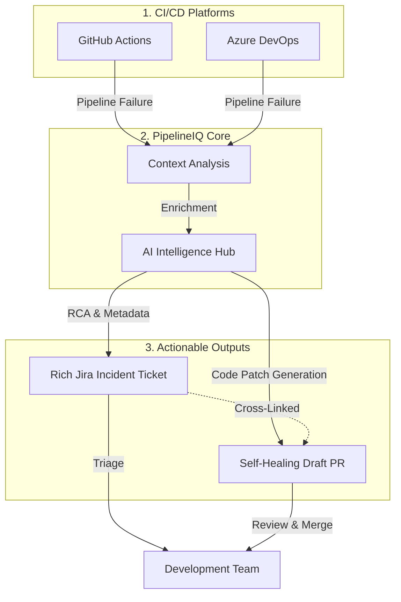

# PipelineIQ

[](https://www.npmjs.com/package/pipelineiq) [](https://www.npmjs.com/package/pipelineiq) [](https://www.npmjs.com/package/pipelineiq)
    
    

PipelineIQ is the **Intelligence Layer** that connects **GitHub Actions** and **Azure DevOps** directly to **Jira**. It automatically transforms raw pipeline failures into high-fidelity, intelligent incident tickets with AI-powered Root Cause Analysis (RCA), Failure Summaries, Suggested Remediation, deduplication, and deep operational context.

## 🛑 The Problem

Engineering organizations lose thousands of hours every year because:
* **CI/CD failures are noisy**: Finding the root cause in massive log files is like finding a needle in a haystack.
* **Manual Debugging**: Developers spend 30-60 minutes just gathering context for a single failure.
* **Incident Fragmentation**: Jira tickets are often missing, inconsistent, or lack the metadata needed for long-term reliability analysis.
* **Duplicate Flood**: Similar failures trigger duplicate alerts, causing notification fatigue.

There is currently **no unified integration** that automatically transforms a pipeline failure into a structured Jira incident. Most teams rely on ephemeral Slack notifications, manual log analysis, and inconsistent manual ticketing—leading to a massive "intelligence gap" in DevOps operations.

## 💡 Why PipelineIQ?

PipelineIQ exists to be the **intelligence layer for CI/CD operations**. It transforms raw pipeline failures into **fully operationalized incident records**.

By bridging the gap between your logs and Jira with AI-driven root cause analysis (RCA), PipelineIQ:
* **Reduces MTTR**: Provides instant debugging context and remediation steps.
* **Eliminates Toil**: Automates the collection of repository, commit, and runner metadata.
* **Standardizes Reliability**: Ensures every incident is recorded with consistent, high-fidelity data (80-120 fields).
* **Focuses Teams**: Smart deduplication ensures teams fix the *problem*, not the *symptom*.

## 🎯 Core Value: Seamless CI/CD → Jira Integration

- **🔄 Automatic Detection**: Monitors GitHub Actions and Azure DevOps pipeline failures
- **🎫 Smart Jira Tickets**: Creates rich, contextual Jira issues with AI-powered Root Cause Analysis (RCA)
- **📊 Operational Context**: Includes repository, branch, commit, environment, and 100+ diagnostic fields
- **🤖 AI-Native**: High-fidelity summaries and suggested remediation steps
- **🔒 Enterprise Ready**: Secret masking, GDPR compliance, and custom field support

PipelineIQ is the bridge that transforms CI/CD failures into actionable Jira tickets without manual intervention.

## 🚀 Quick Start


### CLI

PipelineIQ can be used as a global command or via `npx` for one-off tasks.

#### Option 1: Global Install (Recommended for local use)
Install globally to use the `pipelineiq` command directly from any terminal:
```bash
npm install -g pipelineiq

# Now run directly
pipelineiq analyze --jira-project "DEVOPS"
```

#### Option 2: Use with `npx` (Recommended for CI/CD)
No installation required; `npx` will fetch the latest version and run it:
```bash
npx pipelineiq analyze --jira-project "DEVOPS"
```

## 🏗 How It Works: CI/CD → Jira Integration



**Integration Flow:**
1. **🔍 Failure Detection**: PipelineIQ monitors your CI/CD pipelines for failures
2. **🧠 Context Analysis**: Extracts repository, branch, commit, and failure details
3. **🤖 AI Processing**: Generates root cause analysis and remediation suggestions
4. **🔄 Deduplication**: Smart signature matching prevents duplicate tickets for similar failures
5. **🎫 Jira Creation**: Creates or updates comprehensive tickets with all operational context
6. **🩹 Self-Healing**: Automatically generates and pushes code patches as Draft PRs

**What Gets Bridged:**
- ✅ Pipeline metadata → Jira custom fields
- ✅ Commit links → Jira remote links  
- ✅ Error logs → Jira descriptions
- ✅ Environment context → Jira labels
- ✅ AI insights → Jira comments
- ✅ Automated Code Fixes → Draft Pull Requests

## 📦 Installation

### Global Installation (Direct CLI)
Best for developers who want to use PipelineIQ frequently from their local machine.
```bash
npm install -g pipelineiq
# Access directly via 'pipelineiq'
```

### Local Installation (Project-based)
Best for including PipelineIQ as a dependency in your repository.
```bash
npm install pipelineiq
# Access via 'npx pipelineiq'
```

### From Source

```bash
git clone https://github.com/meetpatel1111/PipelineIQ.git
cd pipelineiq
npm install
npm run build
```

### Visual Architecture

PipelineIQ maintains a "Digital Twin" documentation standard where all technical diagrams are 1:1 mapped to the TypeScript ESM codebase.

| Diagram | Link | Purpose |
| :--- | :--- | :--- |
| **🏗 Structural Architecture** | [View in diagrams.net](https://app.diagrams.net/?url=https://raw.githubusercontent.com/meetpatel1111/PipelineIQ/main/pipelineiq-arch-structural.drawio) | ESM Engine, Signatures, and AI Hub |
| **🔄 Operational Flow** | [View in diagrams.net](https://app.diagrams.net/?url=https://raw.githubusercontent.com/meetpatel1111/PipelineIQ/main/pipelineiq-arch-operational-flow.drawio) | End-to-end processing & logic deep-dives |
| **🌐 Deployment Topology** | [View in diagrams.net](https://app.diagrams.net/?url=https://raw.githubusercontent.com/meetpatel1111/PipelineIQ/main/pipelineiq-arch-deployment-topology.drawio) | Network egress, context boundaries, and security |

> [!TIP]
> For a detailed technical breakdown of the engine, AI strategies, and security model, see the full [ARCHITECTURE.md](./ARCHITECTURE.md).

## 📊 Features

### Core Capabilities

- **Failure Detection**: Automatically detects failed GitHub workflows and Azure DevOps pipelines.
- **Automated Log Fetching**: Natively fetches logs from GitHub/Azure APIs—no log redirection required.
- **Proactive Validation**: Built-in connectivity checks for Jira and AI providers before analysis starts.
- **Intelligent Enrichment**: AI-powered analysis with deterministic fallbacks.
- **Deduplication**: Prevents duplicate tickets with smart signature matching.
- **Rich Context**: 80-120 operational fields vs typical 5-10.
- **Multi-Platform**: Native support for GitHub Actions and Azure DevOps.
- **Autonomous Self-Healing**: Automatically generates and submits Draft Pull Requests to fix pipeline failures, complete with AI-generated code patches and strict safety guardrails.

### AI Features

- **Optional AI**: Works fully without AI - deterministic fallbacks always available.
- **Multi-Provider AI Hub**: Native support for **Google Gemini** (v1.5/2.0), **OpenAI** (GPT-4o), **Anthropic** (Claude 3.5), and **Azure OpenAI**.
- **AI Prompt Factory**: Advanced context aggregation including log snippets, Git history, and signature heuristics with a Token Limit Guard.
- **Local Workspace Context**: The AI can dynamically read failing source code files directly from the runner's workspace to fix complex application logic bugs.
- **Smart Analysis**: Instant Root Cause Analysis (RCA), remediation guidance, and severity prediction.
- **Confidence Gating**: Threshold-based logic (`>= 0.6`) that discards low-confidence output and triggers deterministic fallbacks.
- **Dynamic Model Selection**: Override models at runtime via CLI (e.g., `--ai-model gpt-4o`).

### Autonomous Self-Healing

- **AI Code Fixer**: Generates precise snippet-level code patches based on diagnostic context and source code.
- **Atomic Pull Requests**: Automatically creates isolated branches and Draft PRs in GitHub or Azure DevOps.
- **Safety Guardrails**: Strict limits on files changed (default: 3), lines changed (default: 50), and blocked paths (e.g., `.env`, `Dockerfile`).
- **Human-in-the-Loop**: All fixes are submitted as Draft PRs requiring human review before merging.
- **Jira Integration**: Successfully created fix PRs are automatically cross-linked in the generated Jira incident ticket.

## Log Parsing

- **Format Support**: GitHub Actions, Azure DevOps, Terraform, Kubernetes, Docker, JUnit
- **Smart Extraction**: Error messages, stack traces, exit codes, failed commands
- **Security Focus**: Automatic secret masking and security issue detection
- **Performance Insights**: Timeout detection, performance issue identification

### Jira Integration

- **Multi-Platform Renderer**: Intelligent branching between **ADF v3** (Jira Cloud) and **WikiMarkup** (Jira Server/DC).
- **Custom Fields**: Full support for mapping 100+ operational metadata fields.
- **API Reliability**: Automatic truncation of long fields (Summary/Description) to ensure Atlassian API compliance.
- **Dedup Search**: JQL-based duplicate detection with configurable time windows.
- **Bulk Operations**: High-performance client for transitions, linking, and enrichment comments.

> [!TIP]
> **Jira Workflow Tip**: To ensure issues remain unassigned by default across any organization, you can configure your Jira workflow. Go to the **Create** transition → **Post Functions** → Add **Update Issue Field** → Set **Assignee** to **Unassigned**.

## 🔧 Configuration

### Basic Config

```json
{
  "jira": {
    "baseUrl": "https://yourorg.atlassian.net",
    "email": "pipelineiq@yourorg.com",
    "apiToken": "your-api-token"
  },
  "jiraProject": "DEVOPS",
  "ai": {
    "mode": "assist",
    "provider": "openai",
    "apiKey": "your-ai-api-key"
  },
  "dedup": {
    "enabled": true,
    "windowHours": 24
  }
}
```

### AI Modes

- **disabled**: No AI calls, uses deterministic fallbacks only
- **assist**: AI with conservative settings, falls back on low confidence
- **full**: Full AI features with lower confidence thresholds

## 📈 Benefits

### For Teams

- **Reduce MTTR**: 20%+ faster resolution with intelligent context
- **Reduce Toil**: Automated ticket creation and enrichment
- **Standardize Reporting**: Consistent incident structure and data
- **Reduce Duplicates**: 70%+ fewer duplicate tickets

### For Organizations

- **Operational Intelligence**: Deep insights into failure patterns and trends
- **Reliability Analytics**: MTTR tracking, failure heatmaps, team scoring
- **Audit Trail**: Complete provenance tracking for all fields
- **Cost Optimization**: Reduced engineering time and faster resolution

## 🔍 CLI Usage

### Analyze Logs

```bash
# Analyze GitHub Actions logs
pipelineiq analyze --logs ./github-logs --source github --format github-actions

# Analyze Azure DevOps logs (installed globally)
pipelineiq analyze --logs ./ado-logs --source azure-devops --format azure-devops

# Full analysis with GitHub Actions context
pipelineiq analyze \
  --jira-url "${{ secrets.JIRA_URL }}" \
  --jira-project "SCRUM" \
  --jira-email "${{ secrets.JIRA_EMAIL }}" \
  --jira-token "${{ secrets.JIRA_TOKEN }}" \
  --github-token "${{ secrets.GITHUB_TOKEN }}" \
  --ai-mode assist \
  --ai-provider gemini \
  --ai-model "gemini-2.5-flash-lite" \
  --ai-api-key "${{ secrets.AI_API_KEY }}" \
  --environment main \
  --repository "${{ github.repository }}" \
  --branch "${{ github.ref_name }}" \
  --commit "${{ github.sha }}" \
  --pipeline "CI/CD Pipeline with PipelineIQ" \
  --run-id "${{ github.run_id }}" \
  --run-number "${{ github.run_number }}" \
  --actor "${{ github.actor }}" \
  --issue-type Bug \
  --event-name "${{ github.event_name }}" \
  --run-attempt "${{ github.run_attempt }}" \
  --runner-os "${{ runner.os }}" \
  --runner-arch "${{ runner.arch }}" \
  --api-url "${{ github.api_url }}" \
  --job-name "${{ github.job }}" \
  --repository-owner "${{ github.repository_owner }}" \
  --format github-actions \
  --self-heal \
  --self-heal-min-confidence 0.8

> [!IMPORTANT]
> **GitHub Workflow Permissions for Self-Healing**
>
> In order for PipelineIQ to create branch references and open Pull Requests, the workflow's `GITHUB_TOKEN` must be granted **write** permissions. Add the following block to your workflow file (e.g., `.github/workflows/main.yml`):
>
> ```yaml
> permissions:
>   contents: write
>   pull-requests: write
> ```

# To run a self-healing dry run (generates AI patch but doesn't push to GitHub):
pipelineiq analyze --logs ./logs --self-heal --self-heal-dry-run

```

### Configuration Management

```bash
# Initialize config
pipelineiq config --init

# Show current config
pipelineiq config --show

# Validate config
pipelineiq config --validate

# Test connectivity
pipelineiq test --jira --ai
```

### Log Parsing

```bash
# Parse logs to JSON
pipelineiq parse --logs ./build.log --format terraform --output parsed.json

# Support for multiple formats
pipelineiq parse --logs ./logs/ --format kubernetes --output k8s-parsed.json
```

## 🧪 Development

### Project Structure

```
pipelineiq/
├── src/
│   ├── core/                 # Main processing engine
│   ├── cli/                  # Command-line interface
│   ├── github-action/        # GitHub Actions integration
│   ├── azure-devops/         # Azure DevOps integration
│   └── index.ts              # Main entry point
├── bin/pipelineiq           # CLI executable
├── action.yml               # GitHub Action metadata
├── task.json                # Azure DevOps task metadata
├── examples/                # Usage examples and patterns
├── docs/                    # Documentation
└── ARCHITECTURE.md          # Technical Deep Dive
```

### Building

```bash
# Build all components
npm run build

# Run tests
npm test

# Type checking
npm run typecheck

# Lint code
npm run lint

# Clean build artifacts
npm run clean
```

## 📚 Documentation

- [Product Requirements Document](./PRD.md) - Comprehensive PRD with all features
- [Architecture Guide](./ARCHITECTURE.md) - System design and technical patterns
- [API Documentation](./docs/api/) - Detailed API reference
- [Examples](./examples/) - Usage examples and patterns

## 🤝 Contributing

We welcome contributions! Please see [CONTRIBUTING.md](./CONTRIBUTING.md) for guidelines.

### Development Workflow

1. Fork the repository
2. Create a feature branch
3. Make your changes
4. Add tests for new functionality
5. Ensure all tests pass
6. Submit a pull request

## License

Apache License 2.0 - see LICENSE file for details.

- [GitHub Repository](https://github.com/meetpatel1111/PipelineIQ)
- [npm Package](https://www.npmjs.com/package/pipelineiq)

---

**PipelineIQ** - Transforming CI/CD failures into operational intelligence.
